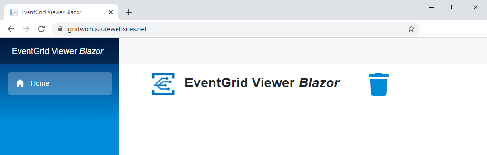
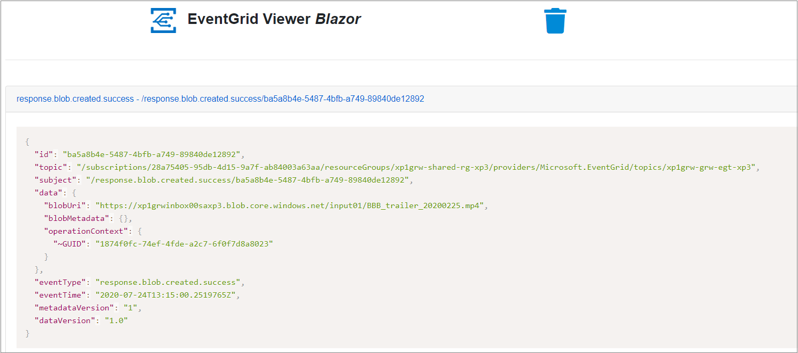

# Test MediaInfo service

Testing an application is an integral part of the application development life cycle. Testing ensures that your application or service will perform as expected when published.

You can test your deployed application in Azure or locally, and in both cases, you can monitor the events sent to the topic.

## How to test Gridwich projects in Azure

1. Use the following URL to open the Event Grid Viewer app:

   `https://<your app name>-<your environment name>.azurewebsites.net`

   The Event Grid Viewer Blazor should load, with no event in the list.

   

1. Prepare the input content.

   In an Azure Storage Account attached to Azure Media Services, for example `cl1grwinbox00sa<your-environment-name>`, create a container, for example `input01`, and upload a video file in it, for example `BBB_trailer_20200225.mp4`.

   

1. Send a message to the deployed Function App.

   Find the Gridwich Azure Function App in the portal, select the Event Grid function, and then select **Testing**.

   POST the following payload:

   ```json
   [
       {
             "eventType": "request.blob.analysis.create",
            "id": "d5ffca18-29f8-4529-ae74-ac88ec5a7ed1",
            "topic": "/NotUsed",
            "subject": "/NotUsed",
            "dataVersion": "1.0",
            "data": {
                "operationContext": "",
                "blobUri": "https://cl4grwinbox00sasb.blob.core.windows.net/input01/BBB_trailer_20200225.mp4",
                "analyzerSpecificData": {
                    "mediaInfo": {
                          "commandLineOptions": {
                            "Complete": "1",
                            "Output": "JSON"
                          }
                    }
                }
            }
       }
   ]
   ```
  
    You should see a `response.blob.analysis.success` event.


## How to test Gridwich projects locally

Make sure your Gridwich project and pipelines are in place, and developer permissions are set up. For more information, see [Gridwich Azure DevOps setup](1-set-up-azure-devops.md).

To create a new cloud development environment, see [Create a new environment](5-create-delete-cloud-environment.md). Verify that you have the correct settings for the environment you're targeting.

To set up your local environment, see [Gridwich local development environment](4-set-up-local-environment.md).

1. Run the Function App. In the command window, you should see the Event Grid function listening locally.

   ```text
   Now listening on: http://0.0.0.0:7071
   Application started. Press Ctrl+C to shut down.

   Http Functions:

           EventGrid: [POST] http://localhost:7071/api/EventGrid
   ```

1. Send the payload to the local function to trigger the encoding.

   In a bash shell, or any tool that can POST payloads, run the command:

   ```bash
   curl -X POST \
           'http://localhost:7071/api/EventGrid' \
           -H 'Content-Type: application/json' \
           -H 'aeg-event-type: Notification' \
           -H 'cache-control: no-cache' \
           -d '[
                   {
                         "eventType": "request.blob.analysis.create",
                        "id": "d5ffca18-29f8-4529-ae74-ac88ec5a7ed1",
                        "topic": "/NotUsed",
                        "subject": "/NotUsed",
                        "dataVersion": "1.0",
                        "data": {
                            "operationContext": "",
                            "blobUri": "https://cl4grwinbox00sasb.blob.core.windows.net/input01/BBB_trailer_20200225.mp4",
                            "analyzerSpecificData": {
                                "mediaInfo": {
                                      "commandLineOptions": {
                                        "Complete": "1",
                                        "Output": "JSON"
                                      }
                                }
                            }
                        }
                   }
               ]'
   ```

## Resources

Product documentation:

- [Gridwich cloud media system](https://learn.microsoft.com/azure/architecture/reference-architectures/media-services/gridwich-architecture)
- [Azure Functions overview](https://learn.microsoft.com/azure/azure-functions/functions-overview)
- [What is Azure Blob storage?](https://learn.microsoft.com/azure/storage/blobs/storage-blobs-overview)
- [What is Azure Event Grid?](https://learn.microsoft.com/azure/event-grid/overview)

Microsoft Learn modules:

- [Explore Azure Event Grid](https://learn.microsoft.com/training/modules/azure-event-grid)
- [Explore Azure Functions](https://learn.microsoft.com/training/modules/explore-azure-functions)

## Gridwich resources

- [Gridwich operations for Azure Storage](https://learn.microsoft.com/azure/architecture/reference-architectures/media-services/gridwich-storage-service)
- [How to create a Gridwich environment](5-create-delete-cloud-environment.md)
